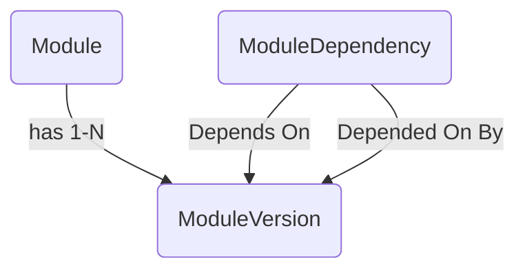

# Perseus Data Model



## Tables

### Module

A `Module` denotes a specific Go module, which is uniquely identified by its name, which is also its import path.  We also store a human-friendly description for each module.

```plaintext
Module:
    ID          int, PK
    Name        string
    Description string
```

### ModuleVersion

A `ModuleVersion` stores a specific, released version of a given `Module` identified by a [Semantic Version](https://semver.org) string.

```plaintext
ModuleVersion:
    ID       int, PK
    ModuleID int, required, FK(Module.ID)
    Version  string
```

### ModuleDependency

An `ModuleDependency` stores a link between specific versions of two Go modules.

```plaintext
ModuleDependency:
    DependentID   int, required, FK(ModuleVersion.ID)
    DependeeID    int, required, FK(ModuleVersion.ID)

primary key is (DependentID, DependeeID)
```
